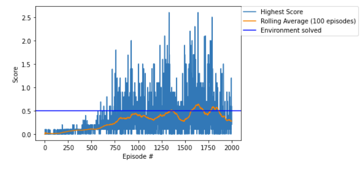
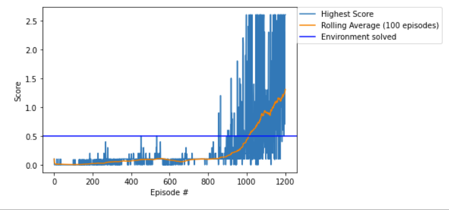
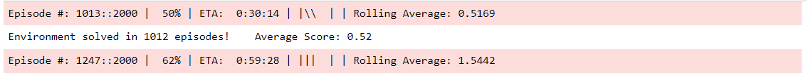

### Two bots with rackets and a ball

For this project, we are working on a variation of a Tennis Unity-ML environment, which is provided 
[here](https://github.com/Unity-Technologies/ml-agents/blob/master/docs/Learning-Environment-Examples.md#tennis).
The observation space consists of 8 variables corresponding to:
* position of the ball,
* velocity of the ball,
* position of each racket, and 
* velocity of each racket

The actions taken by each of the two agents are continuous, and correspond to movement towards or away from the net plus
the jumping height. Every entry in the action vector must be a number between -1 and 1.

To point out the efficacy of the DDPG algorithm, I will point you to 
[this](https://github.com/aresxs91/p2-continuous-control-drlnd) repository. Notice how the environment there included 
multiple agents which learn <b>on their own</b>. You can notice that the way rewards and policy are structured is 
exactly the same, hence why we opted for solving the tennis environment using a DDPG variant adapted for multi-agent 
interactions: <b>Multi Agent Deep Deterministic Policy Gradient (MADDPG)</b>

#### The Learning algorithm

The extension to MADDPG over DDPG is a simple one, yet quite effective. In order to capture information from multiple 
agents the authors in [1] suggested that the critic is augmented to accumulate extra information about all agents' 
policies. The actor network does not have this privilege. These extra information are used during training and not 
testing, hence enabling agents to later on function on their own in a real, competitive scenario. Note that, with 
MADDPG, we can also handle collaborative and mixed environments with minor changes to the way rewards are structured.

#### Ornstein-Uhlenbeck (OU) process

As suggested in the Google DeepMind paper [2], the OU process adds an amount of noise to the action values at each 
timestep, directly correlated to previous noise introduced. This encourages subsequent noise introduced to maintain a 
steady trajectory for longer durations without canceling itself out. This greatly encourages action space exploration 
at a prolonged period of time. For the entirety of this report, we will refer to the OU process as simply "noise".

#### Code breakdown

* `MADDPG/ddpg/`
    
    The `model/` folder contains the implementations of the DDPG Agent (`ddpg_agent.py`) along with the Actor 
(`ddpg_actor.py`) and Critic (`ddpg_agent`) classes.

* `MADDPG/maddpg_agent.py`
    The MADDPG alorithm is implemented here. It is responsible for instantiating and controlling the DDPG agents 
    
    It also provides some helper functions to load and save models as well create score files for plotting in the case of
    early experiment stopping, i.e. when the experiment was solved earlier than expected.
    
* `MADDPG/config.py`
    A class that hosts all configurations to be passed around the various components of this project
    
* `MADDPG/driver.py`
    Handles the training progress, looping through each episode, collecting experience tuples and directing them to the 
    `maddpg_agent` class for agent coordination
    
* `MADDPG/memory.py`
    Shared replay buffer by all agents, which will be accessed by the coordinating `maddpg_agent` when full for 
    experience replay.
    
* `MADDPG/utils.py`
    This file contains supportive functions for command line argument parsing, tensor instantiation and noise function
    implementations
    
* `main.py`
    Orchestrator that will collect command line arguments and feed them into a new Config class. Plots results after 
    training is done.
    
* `MADDPG_Tennis.ipynb`
    While this application can be run from the command line, a python notebook is also included here for the command 
    line inexperienced users!

#### Training goals

The agent is trained through episodical training until the environment tis solved. To solve it, we need to hit an 
average score (over the last 100 episodes) of at least +.5.

#### Network architecture

The actor network maps state to action and has the following structure:

* State input (8 units)
* Hidden layer (256 units) with ReLU activation and batch normalization
* Hidden layer (256 units) with ReLU activation
* Action output (2 units) with tanh activation

The critic network maps state and action to Q value and has the following structure:

* State input (8 units)
* Action input (4 units)
* Hidden layer (256 nodes) with ReLU activation and batch normalization
* Hidden layer (256 nodes) with ReLU activation
* Q-value output (1 node)

#### Hyperparameters

| Hyperparameter | Stored as | Run 1 Value | Run 2 Value | Description |
|:---|---:|---:|---:|:---|
| Max episodes | max_episodes | 2000 | 2000 | Maximum number of episodes to train |
| Max steps | max_steps | 1000 | 1000 | Maximum number of timesteps per episode |
| Replay buffer size | buffer_size | 1e6 | 1e6 | Maximum size of experience replay buffer |
| Replay batch size | batch_size | 512 | 512 | Number of experiences sampled in one batch |
| Actor learning rate | lr_actor | 5e-4 | 5e-4 | Controls parameters update of the online actor model |
| Critic learning rate | lr_critic | 5e-4 | 5e-4 | Controls parameters update of the online critic model |
| Target update mix | target_mix | 5e-2 | 5e-2  | Controls parameters update of the target actor and critic models |
| Discount factor | discount | .99 | .99  | Discount rate for future rewards |
| Noise amplification | epsilon | 1 | 1 | What percentage of the noise should we use when adding it to agents' actions |
| Noise amplification decay | epsilon_decay | 1 | .99 | With what rate should the noise added to agents' actions be downplayed/de-amplified/decay during the experiment |
| Learn every| learn_every | 2 | 2 | After how may timesteps should the agents are allowed to learn |
| Learn numner| learn_number | 1 | 1 | How many times should optimization run after the agents are allowed to learn (disabled here) |
| Ornstein-Uhlenbeck, mu | N/A | 0 | 0  | Mean of the stochastic  process|
| Ornstein-Uhlenbeck, theta | N/A | .15 | .15 | Parameter of the stochastic process |
| Ornstein-Uhlenbeck, sigma | N/A | .2 | .05 | Standard deviation of the stochastic process | 
| Ornstein-Uhlenbeck, sampling distribution | N/A | random_normal | random_normal | Sampling distribution used |

#### Notable differences with DDPG (from Project 2)

* Use a use normal distribution to sample experiences instead of a uniform (with random noise additions) from the Replay Buffer
* The critic's neural network receives concatenated actions and states directly at its input, instead of doing so at the
 first hidden layer of the network.
 
#### Training and results

As can be seen from the two runs that I highlight in this report, training has been particularly difficult to nail with 
the MADDPG algorithm. My first attempt had considerably high noise introduced to the actions which I did not de-amplify
at the later training stages, resulting in very unstable training. The following plot is testament to this:

This run took 1343 episodes to solve the environment. You can find the saved models for the first run under the 
`MADDPG/saved_models/run_1` folder.

What won the day:
* Reducing the standard deviation of the noise function.
* Gradually reducing noise added to actions at later stages of the training routine.
  

Note that the above experiment was halted at step 1247 due to proving that the training has stabilised (and was 
increasingly learning) well above the required criteria of .5 score.

This run took 1013 episodes to solve the environment. You can find the saved models for the first run under the 
`MADDPG/saved_models/run_2` folder.

#### Future work

While noise reduction has done wonders during training, it is apparent that, in later stages, it needs to be reduced 
greatly, as it greatly destabilises the total score. There needs to be a heuristic that negatively correlates to the 
rolling score average and decreases at a rate that the rolling average increases (eventually killing off any added 
noise).

Further to the above, I strongly believe that the random initialization of the network weights and noise signals is the 
unseen benefactor in the whole process. To get to the results seen here, the network needs to quickly pick up early 
signals to ensure stable learning later. One possible solution, by intuition, would be to boost the noise output from 
the OU process to encourage "aggressive" exploration of the action space. However, this needs to work in tandem with the
previous comment, to quickly reduce noise as soon as we need to start all the knowledge accumulated in the very early 
training steps.

Experience replay lets online reinforcement learning agents remember and reuse experiences from the past. In prior work,
experience transitions were uniformly sampled from a replay memory. However, this approach simply replays transitions at
the same frequency that they  were originally experienced, regardless of their significance. To replay important 
transitions more frequently, and therefore learn more efficiently, we can use prioritized experience replay.   

#### References
[1] Lowe, Ryan, et al. "Multi-agent actor-critic for mixed cooperative-competitive environments." Advances in neural 
information processing systems. 2017.

[2] Lillicrap, Timothy P., et al. "Continuous control with deep reinforcement learning." arXiv preprint arXiv:1509.02971
 (2015).